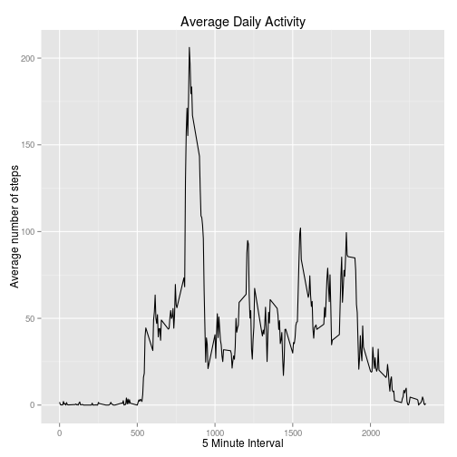
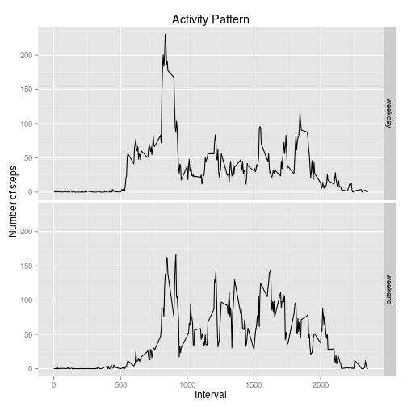

## Loading and preprocessing the data

Libraries used for the preprocessing

```r
library(dplyr)
library(lubridate)
```

Load the data

```r
rawData <- read.csv(unz("activity.zip", "activity.csv"), header = TRUE, na.strings = "NA" )
rawData <- tbl_df(rawData)
```

Convert date factors to dates

```r
class(unlist(rawData[, "date"]))
```

```
## [1] "factor"
```

```r
data <- rawData %>% 
    mutate(date = ymd(date))
class(unlist(data[, "date"]))
```

```
## [1] "numeric"
```

## What is mean total number of steps taken per day?

Calculate steps per day, mean and median

```r
stepsPerDay <- data %>% 
    group_by(date) %>% 
    summarise(
        steps.per.day=sum(steps, na.rm = TRUE)
        )

meanSteps <- mean(stepsPerDay$steps, na.rm = TRUE)
medianSteps <- median(stepsPerDay$steps, na.rm = TRUE)
```
Steps per day summary

```r
stepsPerDay
```

```
## Source: local data frame [61 x 2]
## 
##          date steps.per.day
## 1  2012-10-01             0
## 2  2012-10-02           126
## 3  2012-10-03         11352
## 4  2012-10-04         12116
## 5  2012-10-05         13294
## 6  2012-10-06         15420
## 7  2012-10-07         11015
## 8  2012-10-08             0
## 9  2012-10-09         12811
## 10 2012-10-10          9900
## ..        ...           ...
```
Histogram

```r
hist(
    stepsPerDay$steps.per.day, 
    main = paste(
        "Histogram of steps per day\nfrom", 
        min(data$date), 
        "to", 
        max(data$date)), 
    xlab = "Steps per day" )
abline(v = meanSteps, col = "blue", lwd = 3)
abline(v = medianSteps, col = "green", lwd = 3)
legend("topright", lty = 1, col = c("blue", "green"), 
       legend = c(
           paste("mean (", round(meanSteps), ")"), 
           paste("median (", round(medianSteps), ")")))
```

 

Results:

- Mean value steps per day = 9354.2295082
- Median value steps per day = 10395


## What is the average daily activity pattern?

Group by intervals and calculate the average per interval

```r
byInterval <- data %>% 
    group_by(interval) %>% 
    summarise(mean.steps = mean(steps, na.rm = TRUE))
```

Get the interval with the maximum number of steps.

```r
intervalWithMaxSteps <- byInterval[which.max(byInterval$mean.steps),]
print(intervalWithMaxSteps)
```

```
## Source: local data frame [1 x 2]
## 
##   interval mean.steps
## 1      835   206.1698
```


```r
library(ggplot2)
qplot(
    byInterval$interval, 
    byInterval$mean.steps, 
    geom = "line", 
    main = "Average Daily Activity",
    xlab = "5 Minute Interval", 
    ylab = "Average number of steps")
```

 

The interval number 835 has the maximum average number of steps (206.1698113 steps).

## Imputing missing values


```r
naRows <- sum(is.na(data$steps))
print(naRows)
```

```
## [1] 2304
```

The dataset contains 2304 rows with missing data.

We handle missing values by setting the average value for the given interval.

```r
cleanedData <- tbl_df(merge(x = data, y = byInterval, by = "interval", all.x = TRUE, all.y = FALSE))
cleanedData <- cleanedData %>% 
    mutate(
        steps = ifelse(
            is.na(steps), 
            mean.steps, 
            steps
            )
        ) %>%
    arrange(date, interval) %>%
    select(steps, date, interval)
naRowsAfterCleaning <- sum(is.na(cleanedData$steps))
```

The dataset contains now 0 rows with missing data.

Redo the calcualtions for steps taken by day.


```r
stepsPerDayCleaned <- cleanedData %>% 
    group_by(date) %>% 
    summarise(
        steps.per.day=sum(steps)
        )

meanStepsCleaned <- mean(stepsPerDayCleaned$steps)
medianStepsCleaned <- median(stepsPerDayCleaned$steps)
```

Histogram

```r
hist(
    stepsPerDayCleaned$steps.per.day, 
    main = paste(
        "Histogram of steps per day\nfrom", 
        min(data$date), 
        "to", 
        max(data$date)), 
    xlab = "Steps per day" )
abline(v = meanStepsCleaned, col = "blue", lwd = 3, lty="dotted")
abline(v = medianStepsCleaned, col = "green", lwd = 2, lty="dashed")
legend("topright", lty = c("dotted", "dashed"), col = c("blue", "green"),
       legend = c(
           paste("mean (", round(meanStepsCleaned), ")"), 
           paste("median (", round(medianStepsCleaned), ")")))
```

 

Results:

- Mean value steps per day = 10766.1886792453
    - Mean before cleaning the NAs: 9354.2295082
- Median value steps per day = 10766.1886792453
    - Median before cleaning the NAs: 10395

When assuming that all missing value actually have a value the mean and median increase if we choose to use the average number of steps of the given interval.

## Are there differences in activity patterns between weekdays and weekends?

Add a new column containing the day and a new column indicating a weekday or a weekend


```r
cleanedDataWithWeekdays <- cleanedData %>%
    # I don't use the weekdays() function here as it produces locale specific values
    mutate(day.type = wday(date, label = TRUE)) %>%
    mutate(day.type = ifelse(day.type %in% c("Sat", "Sun"), "weekend", "weekday")) %>%
    mutate(day.type = as.factor(day.type))
```

Group by day type and interval

```r
byDayAndInterval <- cleanedDataWithWeekdays %>% 
    group_by(day.type, interval) %>% 
    summarise(mean.steps = mean(steps))
```

Plot the activity pattern

```r
qplot(
    interval, 
    mean.steps, 
    data = byDayAndInterval, 
    facets = day.type ~ ., 
    geom="line",
    main = "Activity Pattern",
    xlab = "Interval",
    ylab = "Number of steps") 
```

 


